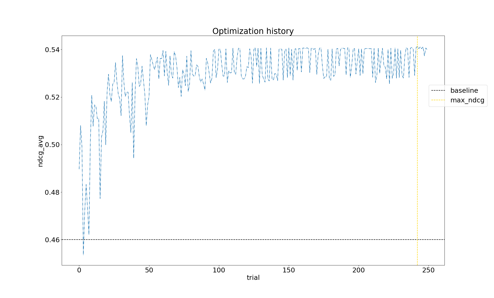

# Scoring Profile Optimization - Azure Cognitive Search

This tutorial demonstrates how to optimize an existing [scoring profile](https://docs.microsoft.com/en-us/azure/search/index-add-scoring-profiles) to improve search relevance in search applications backed by Azure Cognitive Search. We demonstrate how to apply [Bayesian optimization](https://en.wikipedia.org/wiki/Bayesian_optimization) techniques to a scoring profile relative to a judgement list.

## Why Sequential optimization for scoring profile optimization?
In order to efficiently find (near) optimal weights for a scoring profile, we employ sequential model-based optimization (SMBO).
SMBO offers a principled approach to optimization, especially when the loss function is not entirely known.
This is the case for scoring profile optimization because we do not have full access to the
function that retrieves results for a given search query.

In the Tutorial, we use Tree-Parzen-Estimators from the optuna package. 
Optuna also offers more traditional Bayesian procedures and users are encouraged to explore them.

Another advantage of SMBO in this setting is that we do not need to maintain an extra model on top of Azure Search.
In particular, once SMBO is done finding optimal weights these are stored directly
in the target scoring profile.

No extra models or services are required.
No extra maintenance.

For more background on sequential and Bayesian optimization, see this [overview](https://en.wikipedia.org/wiki/Bayesian_optimization)
of the subject on Wikipedia. 

## Generating search results that match a judgement list

This tutorial is for developers and applied scientists who are looking to improve relevance in their Azure Cognitive Search applications. Azure Cognitive Search provides different ways to control search relevance including [scoring profiles](https://docs.microsoft.com/azure/search/index-add-scoring-profiles) and [query term boosting](https://docs.microsoft.com/azure/search/search-query-lucene-examples#example-5-term-boosting). We focus on scoring profiles. Note that because we assume the scoring profile will be tuned relative to a judgement list, we assume that indexed documents and user preferences are somewhat static. Moreover, the static methods presented below may be further combined with methods that are better-suited for dynamic environments where user preferences and articles may change frequently (or in real-time) using reinforcement learning. While dynamic methods are not covered in this tutorial, we recommend the Azure Cognitive Service [Personalizer](https://azure.microsoft.com/en-us/services/cognitive-services/personalizer/) to the interested reader.

## Getting Started

This tutotial assumes you have a Cognitive Search service provisioned and have [added a set of documents to the index](https://docs.microsoft.com/en-us/azure/search/search-what-is-data-import).  

If you just want to read the code, skip the [Setup](#setup) section.

- Part 1: Creating a [judgement list](#creatingthejudgementlist)
- Part 2: Running the [Tutorial](Tutorial)

## Setup
For python tools necessary to run code in the Tutorial, see [setup.py](Tutorial/setup.py)

## Results

### Prerequisites
- An existing [Azure Cognitive Search](https://azure.microsoft.com/services/search/) service
- Python 3.x, Pandas 0.25.x,  Optuna 0.19.x

#### Optional...
- Prior background in Bayesian optimization or "sequential learning" is helpful and discounted cumulative gain are helpful. See for example 

### Creating the judgement list

A judgement list is a desired set of search results ranked by relevance. This could be generated based on historical data, click throughs from search results or created based on a business optimization function.

If you need to create a judegment list based on user activity, you can log search results clicks from your app to [Application Insights](https://docs.microsoft.com/azure/azure-monitor/app/app-insights-overview). The [knowledge mining solution accelerator](https://github.com/Azure-Samples/azure-search-knowledge-mining) demonstrates how you can log search results and associated clicks. Once you have the data logged, you can generate a judgement list based on user activity.

#### Sample judgement list

|Id |query	|frequency	|document	|position |
--- | --- | --- | --- | --- | 
|0	| query term	|430	| documentId in search index |  0
|0	| query term	|380	| documentId in search index |  1

## Contributing

This project welcomes contributions and suggestions.  Most contributions require you to agree to a
Contributor License Agreement (CLA) declaring that you have the right to, and actually do, grant us
the rights to use your contribution. For details, visit https://cla.opensource.microsoft.com.

When you submit a pull request, a CLA bot will automatically determine whether you need to provide
a CLA and decorate the PR appropriately (e.g., status check, comment). Simply follow the instructions
provided by the bot. You will only need to do this once across all repos using our CLA.

This project has adopted the [Microsoft Open Source Code of Conduct](https://opensource.microsoft.com/codeofconduct/).
For more information see the [Code of Conduct FAQ](https://opensource.microsoft.com/codeofconduct/faq/) or
contact [opencode@microsoft.com](mailto:opencode@microsoft.com) with any additional questions or comments.
